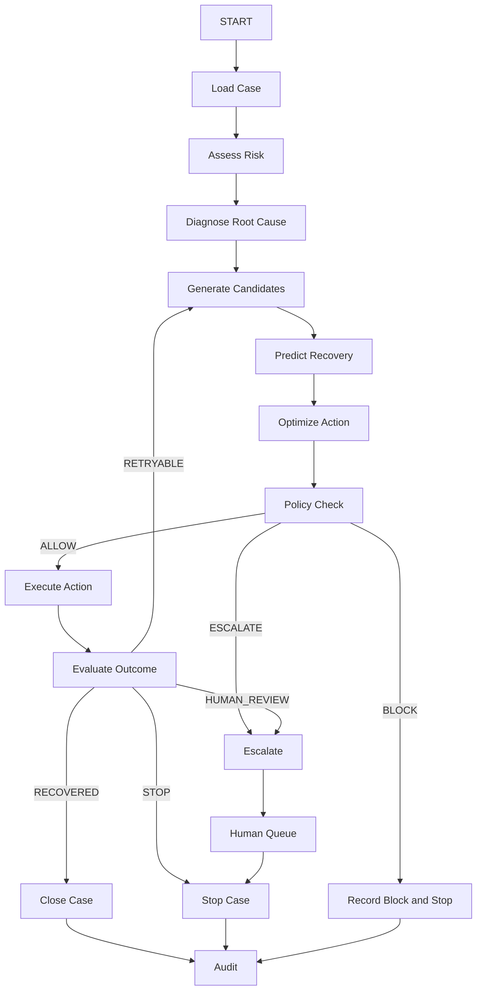

# REVIVE Agent Specification

## 1. Objective

The REVIVE agent is a stateful LangGraph workflow orchestrator.

It coordinates model outputs, decisioning, policy checks, tools, outcomes, bounded retries, escalation, and audit events.

It does not replace predictive models or deterministic policy.

See [ARCHITECTURE.md](./ARCHITECTURE.md) and [POLICY.md](./POLICY.md).

## 2. RecoveryState

Implement a typed graph state containing at least:

```python
class RecoveryState(TypedDict, total=False):
    case_id: str
    customer_id: str
    source_type: str
    source_id: str
    amount_at_risk: float
    customer_context: dict
    transaction_context: dict
    risk_score: float
    root_cause: str
    root_cause_confidence: float
    candidate_actions: list[dict]
    recovery_predictions: list[dict]
    selected_action: str
    expected_recovery: float
    expected_net_recovery: float
    decision_confidence: float
    policy_decision: str
    policy_reasons: list[str]
    intervention_id: str
    execution_result: dict
    outcome: dict
    attempt_number: int
    communication_count: int
    retry_count: int
    next_step: str
    stop_reason: str
    audit_context: list[dict]
    errors: list[dict]
```

Use the production domain types defined in application code instead of relying on raw dictionaries where practical.

## 3. Graph



## 4. Nodes

### load_case

Loads customer and source-of-risk context. No decision-making.

### assess_risk

Runs the risk model and records model version.

### diagnose_root_cause

Runs deterministic mappings and/or root-cause ML.

### generate_candidate_actions

Creates only semantically valid actions.

### predict_recovery

Scores each candidate action using the recovery-propensity model.

### optimize_action

Uses the active DecisionPolicy implementation.

### policy_check

Applies [POLICY.md](./POLICY.md) deterministically.

### execute_action

Calls explicitly authorized tools.

### evaluate_outcome

Determines recovery, retryability, stop condition, or escalation.

### close_case

Persists final state and financial outcome.

### escalate

Creates a human-review task and ends autonomous execution for that case.

## 5. Tools

Customer:

```text
get_customer_profile()
get_customer_history()
get_customer_contact_preferences()
```

Payment:

```text
get_payment_status()
retry_payment()
schedule_retry()
update_payment_method()
use_alternate_gateway()
```

Communication:

```text
send_sms()
send_email()
send_whatsapp()
initiate_voice_call()
```

Invoice:

```text
get_invoice_status()
send_invoice_reminder()
create_finance_escalation()
```

Audit:

```text
record_audit_event()
record_outcome()
```

## 6. Tool Security

The agent may not directly mutate the database or invoke arbitrary APIs.

Every mutating tool must:

1. Validate input.
2. Validate authorization/policy.
3. Check idempotency.
4. Execute.
5. Record the result.

## 7. LLM Responsibilities

Allowed:

- customer-response interpretation
- promise-to-pay extraction
- message generation
- case summarization
- natural-language explanations

Forbidden as source of truth:

- payment status
- monetary arithmetic
- retry limits
- policy thresholds
- financial authorization
- recovered amount
- lifecycle state

## 8. Promise-to-Pay

Input:

```text
Kal shaam payment kar dunga.
```

Structured output:

```json
{
  "intent": "PROMISE_TO_PAY",
  "promise_to_pay": true,
  "promised_date": "YYYY-MM-DD",
  "confidence": 0.94
}
```

Application logic must validate this output.

On promise:

1. Store promise.
2. Schedule verification.
3. Avoid unnecessary immediate contact.
4. Check authoritative payment status before follow-up.
5. Stop if payment arrives.

## 9. Memory

### Short-term

LangGraph execution state.

### Long-term

PostgreSQL history of interventions, outcomes, and interactions.

### Customer recovery profile

Derived from historical records:

```text
best_action
best_channel
historical_recovery_rate
successful_retry_window
average_response_time
```

Do not introduce a vector database solely for this feature.

## 10. Bounded Loops

All loops are constrained by [POLICY.md](./POLICY.md).

Minimum bounds:

```text
max_interventions_per_case
max_payment_retries
max_customer_contacts
max_recovery_days
```

## 11. Determinism

For fixed models, policies, configuration, and simulator seed, the financial workflow should be materially reproducible.

LLM wording may vary, but financial action permission and stopping behavior remain constrained by deterministic rules.
