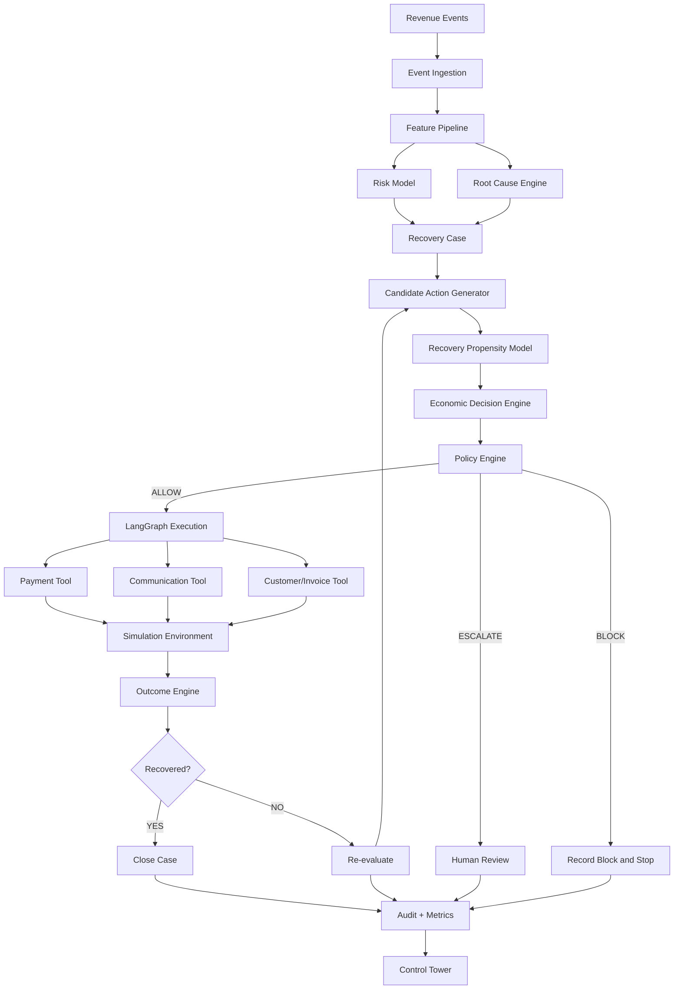

# REVIVE Architecture

## 1. Objective

REVIVE is a modular decision-and-action platform composed of event ingestion, predictive intelligence, economic decisioning, deterministic policy enforcement, stateful agent orchestration, simulated external tools, outcome measurement, auditability, and an operator control tower.

See [PROJECT_OVERVIEW.md](./PROJECT_OVERVIEW.md).

## 2. System Topology



## 3. Layers

### Event Layer

Normalizes incoming payment, subscription, checkout, invoice, and customer-response events.

### Intelligence Layer

Contains risk, root-cause, recovery-propensity, and optional anomaly models.

### Decision Layer

Generates candidate actions and ranks them using expected financial value.

### Policy Layer

A deterministic safety boundary that returns `ALLOW`, `BLOCK`, or `ESCALATE`.

### Agent Layer

LangGraph coordinates approved actions, state, looping, failure recovery, and stopping.

### Execution Layer

Explicit tools perform simulated payment and communication operations.

### Simulation Layer

Provides controlled customer/payment/gateway behavior and fault injection.

### Measurement Layer

Calculates recovered money, intervention cost, baseline comparison, and safety metrics.

### Presentation Layer

Streamlit control tower exposes operational and financial state.

See [TECHNICAL_SPEC.md](./TECHNICAL_SPEC.md) and [UI_SPEC.md](./UI_SPEC.md).

## 4. Component Boundaries

| Component | Owns | Does not own |
|---|---|---|
| Event ingestion | Canonical events | Recovery decisions |
| Feature pipeline | Prediction features | Execution |
| Risk model | Risk probability | Policy |
| Root-cause engine | Cause classification | Authorization |
| Recovery model | Action recovery probability | Final permission |
| Decision engine | Candidate ranking | Action execution |
| Policy engine | Allow/block/escalate | ML prediction |
| Agent | Workflow orchestration | Policy override |
| Tools | Explicit external operations | Strategic decisions |
| Simulator | Environment behavior | Agent policy |
| Audit | Immutable application history | Business decisions |
| UI | Visualization/operator interaction | Core business logic |

## 5. Deployment Shape

Initial deployment should be a single application stack:

```text
Browser
  |
Streamlit
  |
FastAPI/Application Services
  |
+-- PostgreSQL
+-- ML artifacts
+-- LangGraph
+-- Simulator
```

Avoid microservices until required.

## 6. Data Ownership

PostgreSQL is the source of truth for operational domain state. Model artifacts are stored separately and versioned. Generated analytical datasets may use Parquet.

See [SCHEMA.md](./SCHEMA.md).

## 7. Failure Isolation

Required behaviors:

- LLM unavailable -> deterministic template or escalation.
- Payment timeout -> query state before any retry.
- Duplicate event -> idempotent handling.
- Database failure -> no new financial action.
- Model unavailable -> conservative fallback/escalation.
- Policy unavailable -> default deny for financial actions.

## 8. RL Extension Point

The decision layer must expose a policy interface.

Initial implementation:

```text
ExpectedValuePolicy
```

Future optional implementation:

```text
ContextualBanditPolicy
RLPolicy
```

All policy implementations must consume the same decision-state contract and remain downstream of the prediction layer and upstream of deterministic guardrails.

See [AGENT_SPEC.md](./AGENT_SPEC.md) and [ROADMAP.md](./ROADMAP.md).
