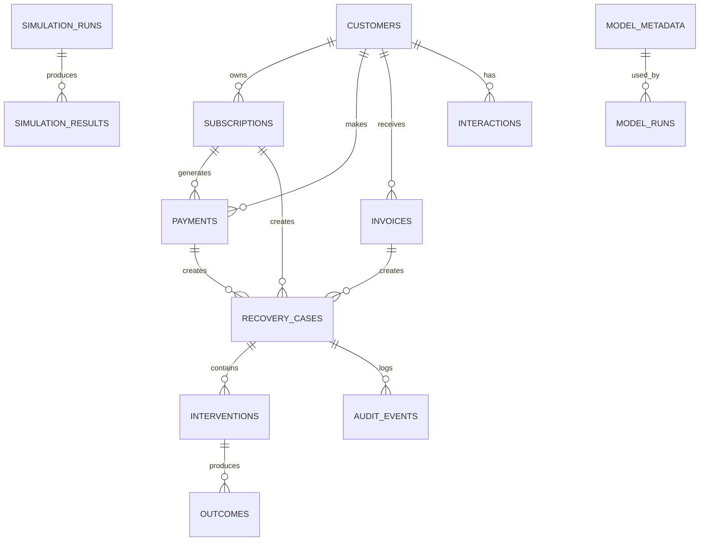

# REVIVE Database Schema

## 1. Database Rules
PostgreSQL. SQLAlchemy 2.x. Alembic. UUID primary keys. UTC timestamps. Monetary values use `NUMERIC(18,2)`. Application monetary calculations use `Decimal`.

See [TECHNICAL_SPEC.md](./TECHNICAL_SPEC.md).

## 2. Relationship Model



## 3. Core Tables

### customers
```sql
CREATE TABLE customers (
 customer_id UUID PRIMARY KEY,
 customer_type VARCHAR(32) NOT NULL,
 country VARCHAR(64) NOT NULL,
 city VARCHAR(128),
 language VARCHAR(32) NOT NULL,
 preferred_channel VARCHAR(32) NOT NULL,
 customer_since TIMESTAMPTZ NOT NULL,
 payment_reliability_score NUMERIC(6,5),
 avg_payment_delay_days NUMERIC(10,4),
 lifetime_value NUMERIC(18,2) NOT NULL,
 active_subscriptions INTEGER NOT NULL DEFAULT 0,
 communication_opt_out BOOLEAN NOT NULL DEFAULT FALSE,
 created_at TIMESTAMPTZ NOT NULL,
 updated_at TIMESTAMPTZ NOT NULL,
 CHECK (payment_reliability_score IS NULL OR payment_reliability_score BETWEEN 0 AND 1),
 CHECK (lifetime_value >= 0),
 CHECK (active_subscriptions >= 0)
);
```

### subscriptions
```sql
CREATE TABLE subscriptions (
 subscription_id UUID PRIMARY KEY,
 customer_id UUID NOT NULL REFERENCES customers(customer_id),
 plan VARCHAR(64) NOT NULL,
 amount NUMERIC(18,2) NOT NULL,
 currency CHAR(3) NOT NULL DEFAULT 'INR',
 billing_cycle VARCHAR(32) NOT NULL,
 start_date DATE NOT NULL,
 next_billing_date DATE NOT NULL,
 status VARCHAR(32) NOT NULL,
 created_at TIMESTAMPTZ NOT NULL,
 updated_at TIMESTAMPTZ NOT NULL,
 CHECK (amount > 0),
 CHECK (next_billing_date >= start_date)
);
```

### payments
```sql
CREATE TABLE payments (
 payment_id UUID PRIMARY KEY,
 customer_id UUID NOT NULL REFERENCES customers(customer_id),
 subscription_id UUID REFERENCES subscriptions(subscription_id),
 amount NUMERIC(18,2) NOT NULL,
 currency CHAR(3) NOT NULL DEFAULT 'INR',
 occurred_at TIMESTAMPTZ NOT NULL,
 payment_method VARCHAR(32) NOT NULL,
 gateway VARCHAR(64),
 status VARCHAR(32) NOT NULL,
 failure_code VARCHAR(32),
 failure_reason VARCHAR(64),
 retry_count INTEGER NOT NULL DEFAULT 0,
 idempotency_key VARCHAR(255),
 provider_reference VARCHAR(255),
 created_at TIMESTAMPTZ NOT NULL,
 updated_at TIMESTAMPTZ NOT NULL,
 CHECK (amount > 0),
 CHECK (retry_count >= 0)
);
```

### invoices
```sql
CREATE TABLE invoices (
 invoice_id UUID PRIMARY KEY,
 customer_id UUID NOT NULL REFERENCES customers(customer_id),
 amount NUMERIC(18,2) NOT NULL,
 currency CHAR(3) NOT NULL DEFAULT 'INR',
 issue_date DATE NOT NULL,
 due_date DATE NOT NULL,
 status VARCHAR(32) NOT NULL,
 days_overdue INTEGER NOT NULL DEFAULT 0,
 paid_at TIMESTAMPTZ,
 created_at TIMESTAMPTZ NOT NULL,
 updated_at TIMESTAMPTZ NOT NULL,
 CHECK (amount > 0),
 CHECK (due_date >= issue_date),
 CHECK (days_overdue >= 0)
);
```

### recovery_cases
```sql
CREATE TABLE recovery_cases (
 case_id UUID PRIMARY KEY,
 customer_id UUID NOT NULL REFERENCES customers(customer_id),
 source_type VARCHAR(32) NOT NULL,
 source_id UUID NOT NULL,
 amount_at_risk NUMERIC(18,2) NOT NULL,
 risk_score NUMERIC(6,5),
 root_cause VARCHAR(64),
 root_cause_confidence NUMERIC(6,5),
 recovery_probability NUMERIC(6,5),
 recommended_action VARCHAR(64),
 expected_recovery NUMERIC(18,2),
 expected_net_recovery NUMERIC(18,2),
 decision_confidence NUMERIC(6,5),
 status VARCHAR(32) NOT NULL,
 escalation_required BOOLEAN NOT NULL DEFAULT FALSE,
 stop_reason VARCHAR(128),
 workflow_run_id UUID,
 created_at TIMESTAMPTZ NOT NULL,
 updated_at TIMESTAMPTZ NOT NULL,
 closed_at TIMESTAMPTZ,
 CHECK (amount_at_risk >= 0),
 CHECK (risk_score IS NULL OR risk_score BETWEEN 0 AND 1),
 CHECK (root_cause_confidence IS NULL OR root_cause_confidence BETWEEN 0 AND 1),
 CHECK (recovery_probability IS NULL OR recovery_probability BETWEEN 0 AND 1),
 CHECK (decision_confidence IS NULL OR decision_confidence BETWEEN 0 AND 1),
 CHECK (expected_recovery IS NULL OR expected_recovery >= 0),
 CHECK (expected_net_recovery IS NULL OR expected_net_recovery >= 0)
);
```

### interactions
```sql
CREATE TABLE interactions (
 interaction_id UUID PRIMARY KEY,
 customer_id UUID NOT NULL REFERENCES customers(customer_id),
 recovery_case_id UUID REFERENCES recovery_cases(case_id),
 channel VARCHAR(32) NOT NULL,
 occurred_at TIMESTAMPTZ NOT NULL,
 message TEXT NOT NULL,
 customer_response TEXT,
 intent VARCHAR(64),
 promise_to_pay BOOLEAN,
 promised_date DATE,
 llm_confidence NUMERIC(6,5),
 generation_method VARCHAR(32),
 created_at TIMESTAMPTZ NOT NULL
);
```

### interventions
```sql
CREATE TABLE interventions (
 intervention_id UUID PRIMARY KEY,
 case_id UUID NOT NULL REFERENCES recovery_cases(case_id),
 action_type VARCHAR(64) NOT NULL,
 attempt_number INTEGER NOT NULL,
 scheduled_at TIMESTAMPTZ,
 executed_at TIMESTAMPTZ,
 cost NUMERIC(18,2) NOT NULL DEFAULT 0,
 policy_decision VARCHAR(16) NOT NULL,
 policy_reason TEXT,
 policy_version VARCHAR(64) NOT NULL,
 status VARCHAR(32) NOT NULL,
 idempotency_key VARCHAR(255) NOT NULL UNIQUE,
 provider_reference VARCHAR(255),
 created_at TIMESTAMPTZ NOT NULL,
 CHECK (attempt_number >= 1),
 CHECK (cost >= 0)
);
```

### outcomes
```sql
CREATE TABLE outcomes (
 outcome_id UUID PRIMARY KEY,
 case_id UUID NOT NULL REFERENCES recovery_cases(case_id),
 intervention_id UUID NOT NULL REFERENCES interventions(intervention_id),
 success BOOLEAN NOT NULL,
 amount_recovered NUMERIC(18,2) NOT NULL DEFAULT 0,
 failure_reason VARCHAR(128),
 payment_status_after VARCHAR(32),
 occurred_at TIMESTAMPTZ NOT NULL,
 created_at TIMESTAMPTZ NOT NULL,
 CHECK (amount_recovered >= 0)
);
```

### audit_events
```sql
CREATE TABLE audit_events (
 event_id UUID PRIMARY KEY,
 case_id UUID REFERENCES recovery_cases(case_id),
 event_type VARCHAR(64) NOT NULL,
 actor_type VARCHAR(32) NOT NULL,
 actor_id VARCHAR(128),
 event_time TIMESTAMPTZ NOT NULL,
 correlation_id VARCHAR(255) NOT NULL,
 input_snapshot JSONB,
 decision JSONB,
 policy_result JSONB,
 execution_result JSONB,
 outcome JSONB,
 metadata JSONB,
 created_at TIMESTAMPTZ NOT NULL
);
```

### simulation_runs
```sql
CREATE TABLE simulation_runs (
 run_id UUID PRIMARY KEY,
 strategy VARCHAR(64) NOT NULL,
 scenario VARCHAR(64) NOT NULL,
 seed INTEGER NOT NULL,
 dataset_version VARCHAR(64) NOT NULL,
 dataset_hash VARCHAR(128) NOT NULL,
 model_versions JSONB,
 policy_version VARCHAR(64) NOT NULL,
 configuration_hash VARCHAR(128) NOT NULL,
 started_at TIMESTAMPTZ NOT NULL,
 completed_at TIMESTAMPTZ,
 status VARCHAR(32) NOT NULL
);
```

### simulation_results
```sql
CREATE TABLE simulation_results (
 result_id UUID PRIMARY KEY,
 run_id UUID NOT NULL REFERENCES simulation_runs(run_id),
 total_events INTEGER NOT NULL,
 total_cases INTEGER NOT NULL,
 revenue_at_risk NUMERIC(18,2) NOT NULL,
 gross_recovered NUMERIC(18,2) NOT NULL,
 intervention_cost NUMERIC(18,2) NOT NULL,
 net_recovered NUMERIC(18,2) NOT NULL,
 recovery_rate NUMERIC(8,5) NOT NULL,
 incremental_revenue NUMERIC(18,2),
 policy_violations INTEGER NOT NULL DEFAULT 0,
 duplicate_actions INTEGER NOT NULL DEFAULT 0,
 escalations INTEGER NOT NULL DEFAULT 0,
 stopped_cases INTEGER NOT NULL DEFAULT 0,
 recovered_cases INTEGER NOT NULL DEFAULT 0,
 created_at TIMESTAMPTZ NOT NULL
);
```

### model_metadata
```sql
CREATE TABLE model_metadata (
 model_id UUID PRIMARY KEY,
 model_name VARCHAR(64) NOT NULL,
 model_version VARCHAR(64) NOT NULL,
 model_type VARCHAR(64) NOT NULL,
 feature_schema_version VARCHAR(64) NOT NULL,
 training_dataset_hash VARCHAR(128) NOT NULL,
 artifact_uri TEXT NOT NULL,
 metrics JSONB NOT NULL,
 created_at TIMESTAMPTZ NOT NULL,
 UNIQUE(model_name, model_version)
);
```

### model_runs
```sql
CREATE TABLE model_runs (
 model_run_id UUID PRIMARY KEY,
 model_id UUID NOT NULL REFERENCES model_metadata(model_id),
 simulation_run_id UUID REFERENCES simulation_runs(run_id),
 inference_count INTEGER NOT NULL DEFAULT 0,
 average_latency_ms NUMERIC(12,3),
 created_at TIMESTAMPTZ NOT NULL
);
```

## 4. Required Indexes

```sql
CREATE INDEX idx_payments_customer_time ON payments(customer_id, occurred_at DESC);
CREATE INDEX idx_payments_status ON payments(status);
CREATE INDEX idx_payments_gateway_time ON payments(gateway, occurred_at DESC);
CREATE INDEX idx_invoices_customer ON invoices(customer_id);
CREATE INDEX idx_invoices_status_due ON invoices(status, due_date);
CREATE INDEX idx_interactions_customer_time ON interactions(customer_id, occurred_at DESC);
CREATE INDEX idx_interactions_case_time ON interactions(recovery_case_id, occurred_at DESC);
CREATE INDEX idx_cases_status_priority ON recovery_cases(status, expected_net_recovery DESC);
CREATE INDEX idx_cases_customer ON recovery_cases(customer_id);
CREATE INDEX idx_cases_source ON recovery_cases(source_type, source_id);
CREATE INDEX idx_audit_case_time ON audit_events(case_id, event_time DESC);
CREATE INDEX idx_audit_correlation ON audit_events(correlation_id);
CREATE UNIQUE INDEX uq_payments_idempotency ON payments(idempotency_key) WHERE idempotency_key IS NOT NULL;
CREATE UNIQUE INDEX uq_active_recovery_case ON recovery_cases(source_type, source_id) WHERE status NOT IN ('CLOSED','CANCELLED');
```

## 5. Canonical Values

### Case status
`CREATED`, `ANALYZING`, `ACTION_PENDING`, `EXECUTING`, `WAITING`, `ESCALATED`, `RECOVERED`, `EXHAUSTED`, `CANCELLED`, `CLOSED`.

### Action types
`RETRY_NOW`, `RETRY_LATER`, `PAYMENT_METHOD_UPDATE`, `SMS_REMINDER`, `WHATSAPP_REMINDER`, `EMAIL_REMINDER`, `VOICE_CALL`, `ALTERNATE_PAYMENT`, `ALTERNATE_GATEWAY`, `PAYMENT_LINK`, `FINANCE_ESCALATION`, `NO_ACTION`.

### Policy decisions
`ALLOW`, `BLOCK`, `ESCALATE`.

## 6. Data Integrity Invariants
- Probability/confidence values are between 0 and 1.
- Monetary values are non-negative unless representing a signed accounting metric explicitly defined as such.
- `amount_recovered <= amount_at_risk`.
- Closed cases cannot accept new interventions.
- Communication opt-out blocks new communication actions.
- Idempotency keys are unique.
- Audit records are append-only from the application perspective.

See [POLICY.md](./POLICY.md) for behavioral guardrails.
