# REVIVE

### AI Revenue Recovery & Resilience Platform

REVIVE identifies revenue at risk, diagnoses why it's at risk, selects a recovery intervention, executes it **only when permitted**, and measures the resulting recovery and cost.

It's more than a prediction model — it's a full decision-and-execution loop: ML risk scoring, root-cause analysis, agent orchestration, deterministic policy guardrails, action tools, an audit trail, an economic simulation lab, and fault-injection resilience testing.

> **Safety principle:** an AI recommendation is not an authorization to act. Policy and guardrails are the hard boundary between intelligence and execution.

---

## Table of Contents

- [Core Concept](#core-concept)
- [Architecture](#architecture)
- [Data Model](#data-model)
- [Risk Model](#risk-model)
- [Root-Cause Analysis](#root-cause-analysis)
- [AI Recovery Agent](#ai-recovery-agent)
- [Policy & Guardrails](#policy--guardrails)
- [Recovery Tools](#recovery-tools)
- [Recovery Economics](#recovery-economics)
- [Simulation Lab](#simulation-lab)
- [Resilience & Fault Injection](#resilience--fault-injection)
- [Auditability](#auditability)
- [Repository Structure](#repository-structure)
- [Getting Started](#getting-started)

---

## Core Concept

Naively retrying every failed payment wastes money, annoys customers, and can create unsafe behavior when dependencies fail. REVIVE treats recovery as a **constrained economic decision**.

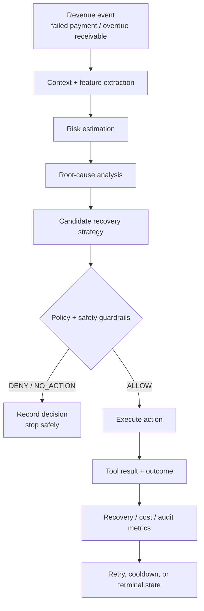

---

## Architecture

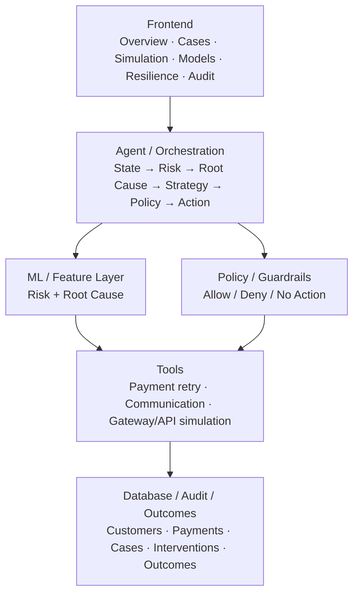

| Layer | Responsibility |
|---|---|
| Database | SQLAlchemy models, Alembic migrations, repository layer |
| Synthetic data | Controlled revenue environment for dev, simulation, testing |
| EDA / validation | Data-quality checks, temporal evaluation split |
| Risk model | Leakage-controlled recovery-risk predictions |
| Root cause | Hybrid deterministic + ML-supported classification |
| Agent | Orchestrates case understanding, strategy, policy, execution |
| Policy | Deterministic safety/economic/business constraints |
| Tools | Payment and communication execution, incl. fault injection |
| Simulation | Baseline vs. REVIVE economic comparison |
| Resilience lab | Controlled failure injection and safety validation |
| Frontend | Operational and evaluation interface |

---

## Data Model

REVIVE ships a synthetic revenue generator so the pipeline can be built and evaluated on controlled, repeatable data.

| Entity | Baseline records | Purpose |
|---|---|---|
| Customers | 5,000 | Identity and behavioral context |
| Subscriptions | 6,137 | Recurring revenue relationships |
| Payments | 36,822 | Payment attempts and outcomes |
| Invoices | 4,323 | Receivable / overdue-revenue context |
| Recovery Cases | 10,504 | Units of revenue-risk/recovery work |
| Interactions | 14,035 | Customer communications |
| Interventions | 21,026 | Recovery actions attempted |
| Outcomes | 21,026 | Results of intervention attempts |

**Temporal evaluation** (reduces leakage, mirrors production forecasting):

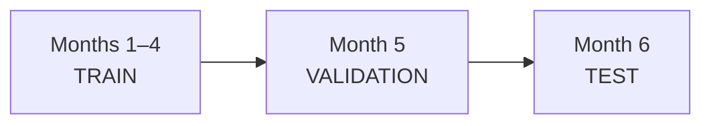

---

## Risk Model

Predicts the likelihood a revenue case can be recovered. Target: `status == "RECOVERED"` is the positive class. Training uses seed `42` with zero-leakage feature extraction.

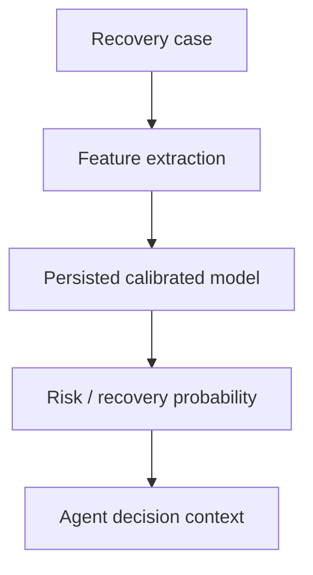

| Model | Role |
|---|---|
| Logistic Regression | Interpretable linear baseline |
| Random Forest | Nonlinear ensemble baseline |
| XGBoost | Gradient-boosted model for stronger nonlinear modeling |

**Features:** `amount`, `hour`, `weekday`, `day_of_month`, `payment_method`, `gateway`, `failure_code`, `failure_reason`, `customer_age_days`, `active_subscriptions`, `lifetime_value`, `payment_reliability_score`, `avg_payment_delay_days`, `historical_success_rate`, `failure_count`, `failures_last_30d`, `prior_recovery_rate`, `current_retry_count`, `intervention_count`

---

## Root-Cause Analysis

A hybrid subsystem combining deterministic mappings with ML-oriented features, since risk probability alone doesn't explain *why* a case failed.

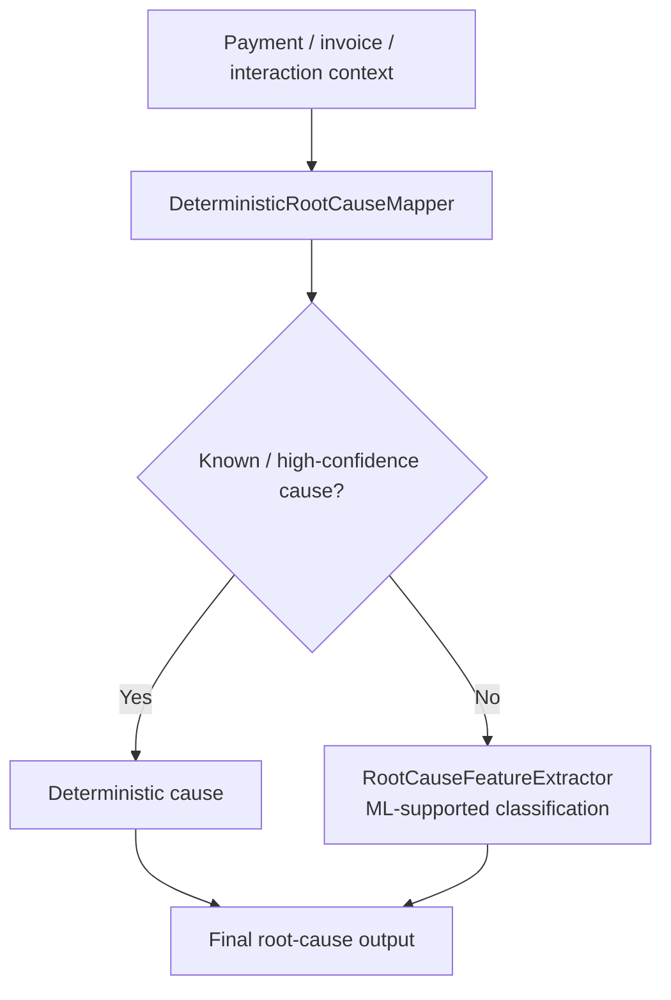

**Classes:** `TEMPORARY_ISSUER_DECLINE`, `INSUFFICIENT_FUNDS`, `EXPIRED_CARD`, `INVALID_PAYMENT_METHOD`, `GATEWAY_FAILURE`, `NETWORK_TIMEOUT`, `CUSTOMER_ABANDONMENT`, `DUPLICATE_PAYMENT`, `OVERDUE_INVOICE`, `UNKNOWN`

---

## AI Recovery Agent

Combines case context, risk, and root cause into a candidate action — then routes it through policy before anything executes.

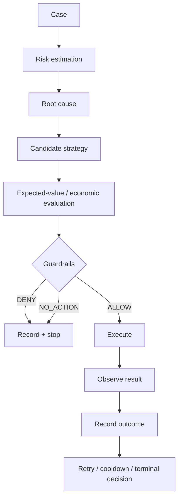

---

## Policy & Guardrails

The system's safety boundary — the agent recommends, guardrails authorize.

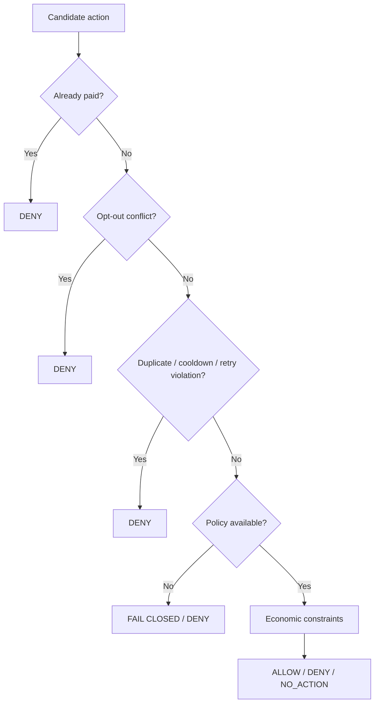

| Decision | Meaning |
|---|---|
| ALLOW | Action satisfies constraints and may proceed |
| DENY | Action is explicitly blocked |
| NO_ACTION | No intervention selected/allowed for the step |
| Forced DENY | A safety-critical condition overrides normal decisioning |

Guardrail types: already-paid protection, duplicate/cooldown protection, customer opt-out enforcement, fail-closed on unavailable policy, retry limits, and economic thresholds.

---

## Recovery Tools

- **Payment tool** — simulates execution through a gateway; supports injected gateway-outage and API-timeout scenarios.
- **Communication tool** — customer-contact interventions (e.g. email reminders); opt-out rules apply here.

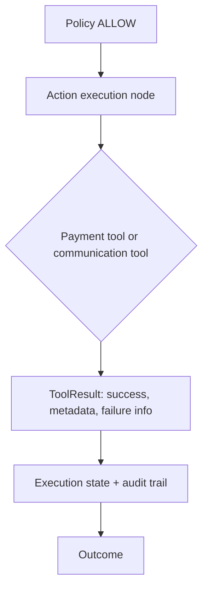

---

## Recovery Economics

Not every successful action is equally valuable — recovery is weighed against intervention cost and policy compliance.

| Metric | Meaning |
|---|---|
| Gross Recovered | Total revenue successfully recovered |
| Intervention Cost | Cost incurred by recovery interventions |
| Net Recovered | Recovered value after intervention cost |
| Recovery Rate | Share of eligible revenue recovered |
| Policy Violations | Unsafe/prohibited intervention count — should stay zero |

Dashboard deltas are directional: more recovered revenue is favorable, lower cost is favorable (a cost reduction shows as a favorable downward delta, not a negative outcome).

---

## Simulation Lab

Compares a **baseline strategy** against **REVIVE** on the same synthetic case population, using consistent economic definitions.

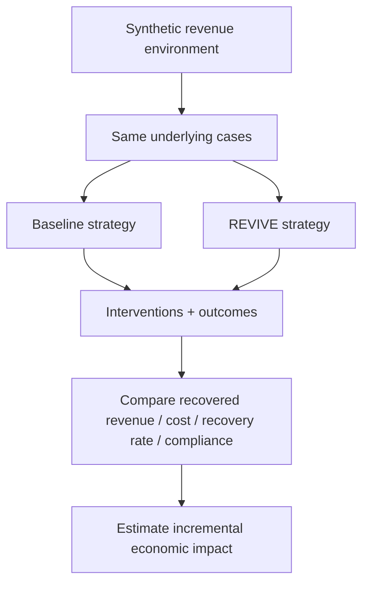

Detailed views preserve exact INR values; compact notation is used only in high-level dashboards.

---

## Resilience & Fault Injection

REVIVE deliberately injects dependency and execution failures to prove that failures **don't create unsafe recovery** — not just that the app stays up.

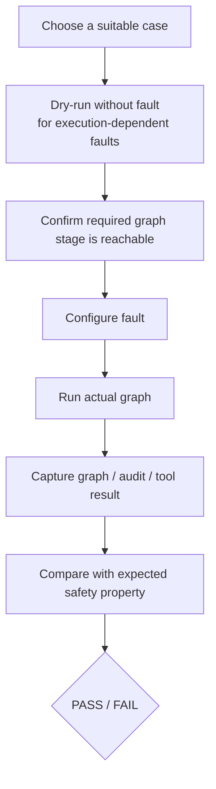

A downstream fault only counts as exercised if the graph actually reached that stage; duplicate prevention is validated when the second event is blocked **before** execution.

| Fault | Expected behavior |
|---|---|
| NONE | Normal execution baseline |
| GATEWAY_OUTAGE | Gateway failure observed safely; no false recovery |
| API_TIMEOUT | API/tool timeout observed safely; no false recovery |
| DUPLICATE_EVENT | First event may succeed; replay blocked before a second intervention |
| ALREADY_PAID | Already-resolved case denied before intervention |
| LLM_UNAVAILABLE | Deterministic fallback used |
| MODEL_UNAVAILABLE | Default/deterministic fallback used |
| POLICY_UNAVAILABLE | Fail closed: forced DENY |
| CUSTOMER_OPT_OUT | Disallowed communication action denied |

---

## Auditability

Every decision leaves an inspectable trail: case ID and revenue context, risk output, root cause, selected strategy, policy decision and guardrail reason, graph node reachability, tool success/failure (and injected fault, if any), recovery amount, intervention cost, outcome status, and retry/cooldown/duplicate info.

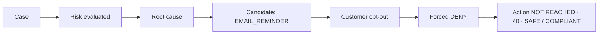

---

## Repository Structure

```
REVIVE/
├── src/
│   ├── agent/              # orchestration + tools
│   ├── data/synthetic/     # synthetic revenue generator
│   ├── database/           # models, DB setup, repositories
│   ├── features/           # feature extraction
│   ├── models/             # risk/root-cause models
│   ├── policy/             # guardrails/policy
│   └── ...
├── frontend/
│   ├── app.py              # main frontend/agent interaction
│   └── pages/
│       └── 3_simulation_lab.py
├── scripts/
│   └── eda_validation.py
├── scratch/
│   └── test_faults.py      # offline resilience validation
├── config/
│   ├── settings.yaml
│   ├── thresholds.yaml
│   └── intervention_policies.yaml
├── alembic/                # DB migrations
├── tests/                  # automated tests
├── pyproject.toml          # Python tooling/configuration
└── ROADMAP.md              # milestone/execution contract
```

---

## Getting Started

> Exact setup depends on the environment configuration in `config/` and dependencies in `pyproject.toml` — check those files for precise versions and required environment variables.

```bash
# clone the repository
git clone https://github.com/HiteshDokku/REVIVE.git
cd REVIVE

# install dependencies
pip install -e .

# apply database migrations
alembic upgrade head

# generate the synthetic revenue environment
python -m src.data.synthetic

# run the EDA / validation pipeline
python scripts/eda_validation.py

# launch the frontend
streamlit run frontend/app.py
```

---

## License

See the repository for license details.
